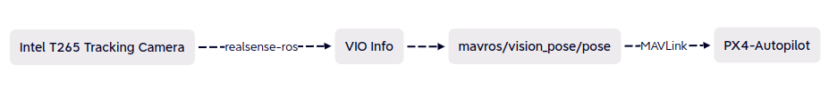

# PX4-Autopilot VIO

from [PX4 User Guide-Visual Inertial Odometry (VIO)](https://docs.px4.io/main/en/computer_vision/visual_inertial_odometry.html)

*Visual Inertial Odometry* (VIO) is a [computer vision](https://docs.px4.io/main/en/computer_vision/) technique used for estimating the 3D *pose* (local position and orientation) and *velocity* of a moving vehicle relative to a *local* starting position. It is commonly used to navigate a vehicle in situations where GPS is absent or unreliable (e.g. indoors, or when flying under a bridge).

从T265的VIO视觉惯性里程计可以拿到位姿和速度加速度等信息，IMU的数据也可以从飞控拿，这个看选择，或者融合。

> **Note**:
>
> The suggested setup uses ROS for routing VIO information to PX4. However, PX4 itself does not care about the source of messages, provided they are provided via the appropriate [MAVLink Interface](https://docs.px4.io/main/en/ros/external_position_estimation.html#px4-mavlink-integration).

PX4不关心信息源，只要是通过MAVLink给到信息即可。

## 1. PX4 Suggested Setup

An example of a suitable tracking camera is the [Intel® RealSense™ Tracking Camera T265](https://docs.px4.io/main/en/peripherals/camera_t265_vio.html).

### 1.1 Camera Mounting

Attach the camera to the companion computer and mount it to the frame:

- Mount the camera with lenses pointing down if at all possible (default).默认的安装方式是向下安装
- Cameras are typically very sensitive to vibration; a soft mounting is recommended (e.g. using vibration isolation foam).采用软安装



* T265的里程计位姿信息通过realsense-ros包传至其定义的`/camera/odom/sample`中，当然话题名可以在launch文件中修改；
* （我的传统认为）一般视觉的位姿信息都传给`mavros/vision_pose/pose`，但这和PX4官方文档说的有些出入。（之前ORB SLAM2测试时，这样可以使PX4正常工作，起飞，但很可能有问题）
* 最后通过MAVLink传给飞控

在[PX4 User Guide - ROS VIO node](https://docs.px4.io/main/en/computer_vision/visual_inertial_odometry.html#vio_ros_node)提到，

The odometry messages should be of the type [`nav_msgs/Odometry` ](http://docs.ros.org/en/noetic/api/nav_msgs/html/msg/Odometry.html)and published to the topic `/mavros/odometry/out`.

关于该消息的定义是：

```c
std_msgs/Header header
string child_frame_id
geometry_msgs/PoseWithCovariance pose
geometry_msgs/TwistWithCovariance twist
```

关于pose和twist的类型，和常见的[PoseStamped](http://docs.ros.org/en/noetic/api/geometry_msgs/html/msg/PoseStamped.html)并不相同，这一点在之前对T265的分析中已经知道，T265发布的`/camera/odom/sample`消息类型是`nav_msgs/Odometry`，和PX4官网的说法一致；

而`mavros/vision_pose`的消息类型为`geometry_msgs/PoseStamped`，显然不能直接remap或者在launch文件中画等号。

System status messages of the type [`mavros_msgs/CompanionProcessStatus` (opens new window)](https://github.com/mavlink/mavros/blob/master/mavros_msgs/msg/CompanionProcessStatus.msg)should be published to the topic `/mavros/companion_process/status`. These should identify the component as `MAV_COMP_ID_VISUAL_INERTIAL_ODOMETRY` (197) and indicate the `state` of the system. Recommended status values are:

- `MAV_STATE_ACTIVE` when the VIO system is functioning as expected,
- `MAV_STATE_CRITICAL` when the VIO system is functioning, but with low confidence, and
- `MAV_STATE_FLIGHT_TERMINATION` when the system has failed or the estimate confidence is unacceptably low.

### 1.2 PX4 Tuning

源自PX4官网

The following parameters must be set to use external position information with EKF2.

| Parameter                                                    | Setting for External Position Estimation                     |
| ------------------------------------------------------------ | ------------------------------------------------------------ |
| [EKF2_EV_CTRL](https://docs.px4.io/main/en/advanced_config/parameter_reference.html#EKF2_EV_CTRL) | Set *horizontal position fusion*, *vertical vision fusion*, *velocity fusion*, and *yaw fusion* according to your desired fusion model. |
| [EKF2_HGT_REF](https://docs.px4.io/main/en/advanced_config/parameter_reference.html#EKF2_HGT_REF) | Set to *Vision* to use the vision as the reference sensor for altitude estimation. |
| [EKF2_EV_DELAY](https://docs.px4.io/main/en/advanced_config/parameter_reference.html#EKF2_EV_DELAY) | Set to the difference between the timestamp of the measurement and the "actual" capture time. For more information see [below](https://docs.px4.io/main/en/computer_vision/visual_inertial_odometry.html#tuning-EKF2_EV_DELAY). |
| [EKF2_EV_POS_X](https://docs.px4.io/main/en/advanced_config/parameter_reference.html#EKF2_EV_POS_X), [EKF2_EV_POS_Y](https://docs.px4.io/main/en/advanced_config/parameter_reference.html#EKF2_EV_POS_Y), [EKF2_EV_POS_Z](https://docs.px4.io/main/en/advanced_config/parameter_reference.html#EKF2_EV_POS_Z) | Set the position of the vision sensor with respect to the vehicle's body frame. |

These can be set in *QGroundControl* > **Vehicle Setup > Parameters > EKF2** (remember to reboot the flight controller in order for parameter changes to take effect).

For more detailed/additional information, see: [ECL/EKF Overview & Tuning > External Vision System](https://docs.px4.io/main/en/advanced_config/tuning_the_ecl_ekf.html#external-vision-system).

