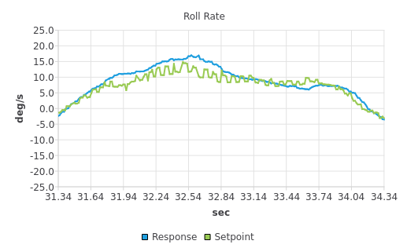

# PX4 commands

## MC Rate control 

多旋翼角速度控制。

* Topic: `/mavros/setpoint_raw/attitude`
* message type: `mavros_msgs/AttitudeTarget`
* header: `mavros_msgs/AttitudeTarget.h`
* detail: [mavros_msgs/AttitudeTarget.msg](https://docs.ros.org/en/api/mavros_msgs/html/msg/AttitudeTarget.html)

注意，`setpoint_raw/target_attitude`是 PX4 loopback 回来的，是一个只能接收的话题。

```python
# Message for SET_ATTITUDE_TARGET
#
# Some complex system requires all feautures that mavlink
# message provide. See issue #402, #418.

std_msgs/Header header

uint8 type_mask
uint8 IGNORE_ROLL_RATE = 1 # body_rate.x
uint8 IGNORE_PITCH_RATE = 2 # body_rate.y
uint8 IGNORE_YAW_RATE = 4 # body_rate.z
uint8 IGNORE_THRUST = 64
uint8 IGNORE_ATTITUDE = 128 # orientation field

geometry_msgs/Quaternion orientation
geometry_msgs/Vector3 body_rate
float32 thrust
```

```python
uint8 IGNORE_ROLL_RATE=1
uint8 IGNORE_PITCH_RATE=2
uint8 IGNORE_YAW_RATE=4
uint8 IGNORE_THRUST=64
uint8 IGNORE_ATTITUDE=128
std_msgs/Header header
uint8 type_mask
geometry_msgs/Quaternion orientation
geometry_msgs/Vector3 body_rate
float32 thrust
```

还没来得及去看PX4源码，暂时记录一下现象：

* 设置body_rate+orientation，能保证姿态环跟的很好
* 设置body_rate，看控制器性能和body_rate_req的导数大小
* 只设置orientation (type_mask=7)，发现偏航角不转；并且姿态环的延时明显变大了
* 设置orientation+body_rate.z，尽管实现了姿态+偏航角控制，但是姿态角的实际值和期望值差距很大，远没有body_rate+orientation时精确

<p>
    
</p>

上图是设置 `type_maek=7` 时，也就是二进制 `111` 用于屏蔽角速度，只使用姿态回路；则角速度环的解算带有锯齿状，比较符合飞控的解算。但是不知何故，<font color="#CC0000">这样赋值却导致偏航几乎处于不控的状态 </font>。

若 `type_maek=64` 飞机会直接从悬停状态掉下 ，相当于thrust直接置零了？离谱，那还整mask干啥？

---

经过测试发现，飞控日志中的 `vehicle_attitude_setpoint/thrust_body.02` 和混控 `actuator_controls_0/control.03` 会有细微差别，首先是时间会延迟0.02s左右，其次某些位置也会有细微差别。

但是如果单独给混控输入，略微麻烦，因为PX4不建议这样做，直接publish会报错：

<pre><font color="#CC0000">ERROR </font><font color="#D3D7CF">[mavlink] </font><font color="#CC0000">SET_ACTUATOR_CONTROL_TARGET not supported with lockstep enabled</font>
<font color="#CC0000">ERROR </font><font color="#D3D7CF">[mavlink] </font><font color="#CC0000">Please disable lockstep for actuator offboard control:</font>
<font color="#CC0000">ERROR </font><font color="#D3D7CF">[mavlink] </font><font color="#CC0000">https://dev.px4.io/master/en/simulation/#disable-lockstep-simulation</font>
</pre>

而且如果只给 `/mavros/actuator_control` 的 header 和 `controls[3]` 赋值，其效果是：

```
---
header: 
  seq: 2678
  stamp: 
    secs: 81
    nsecs: 468000000
  frame_id: ''
group_mix: 0
controls: [0.0, 0.0, 0.0, 0.42287400364875793, 0.0, 0.0, 0.0, 0.0]
---
header: 
  seq: 2679
  stamp: 
    secs: 81
    nsecs: 488000000
  frame_id: ''
group_mix: 0
controls: [0.0, 0.0, 0.0, 0.4215362071990967, 0.0, 0.0, 0.0, 0.0]
```

由于上述mavlink的error，也无法验证这样赋值是否可行。还是尽量不要用  `/mavros/actuator_control` 
