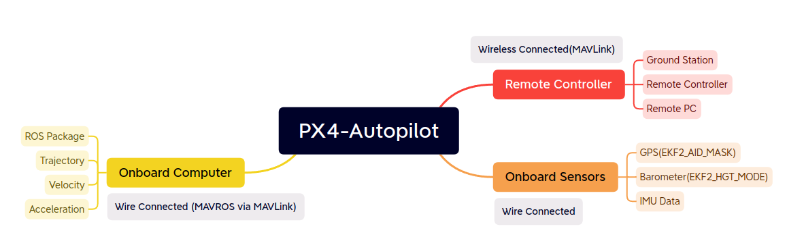
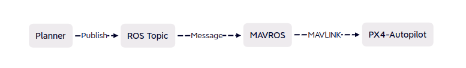

# Controller

**目录：**

* [Pixhawk 6c Instruction](Pixhawk6c.md)
* [PX4 VIO Config](PX4_VIO.md)

相关链接：

* [PX4 Autopilot Github](https://github.com/PX4/PX4-Autopilot)

**PX4-Autopilot软件搭配Pixhawk飞控**，整体架构如下：

总结是无论各种信息源，最终都是要汇总到Pixhawk飞控上，由飞控经由电调，给各个舵机，电机等输出PWM波。

* Onboard Sensors（机载传感器），包括GPS，气压计，惯性测量单元等；这些传感器通过线与Pixhawk4相连，传输数据；这些传感器就保证了无人机的基本飞行。
* Remote Controller（远程控制），包含遥控器，地面站，远程电脑等。通过图传，数传等方式，MAVLink协议进行传输。
* Onboard Computer（板载计算机），通过MAVROS，遵从MAVLink协议进行通信。

**连接板载计算机后**，配上planner：

从PC到飞控的信息流如上，这并不代表反向没有信息流。

