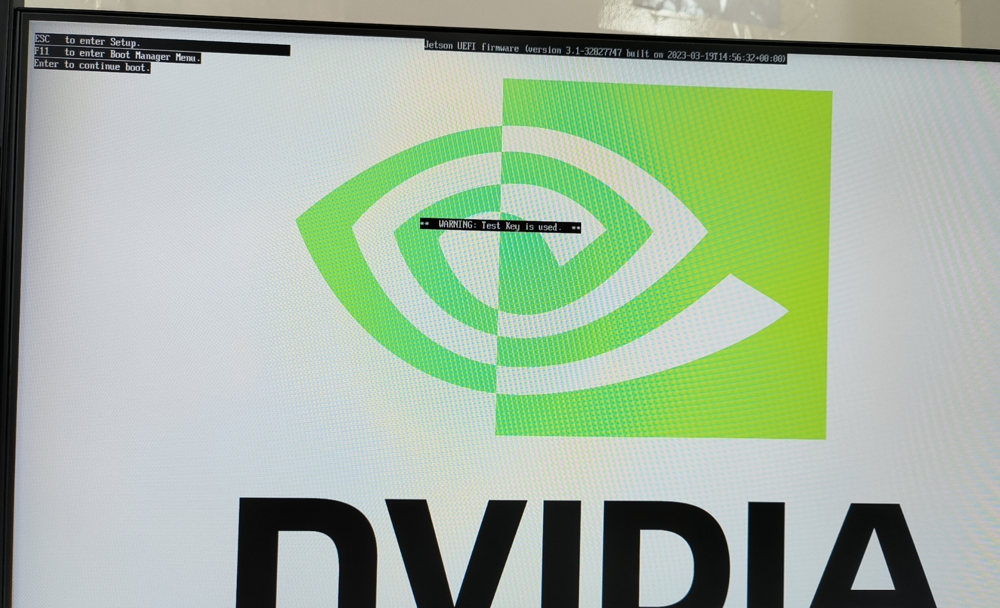
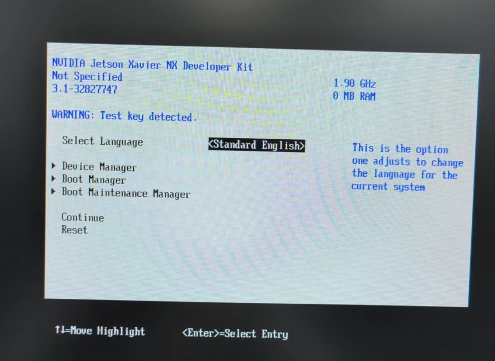

# Bug Record

## 1. Jetson Xavier NX: Test key is used

问题描述：在Jetson Xavier NX上电启动时，屏幕显示NVIDIA logo，之后出现`WARNING: Test key used`，之后无法正常启动，再次进入若干遍这个过程，如图所示：

经测试，左上角提示的ESC,F11,Enter按键都无效。

等待，直到出现下图：

这个界面完全无法用键盘操作，十分卡顿延迟极高，但等待一段时间后会自动退出，进入上文所述循环启动状态；

直到`WARN: Test key used`后，其下方出现`Attempt to directly boot`，系统才能正常启动；也有可能始终无法启动，直到黑屏。

经过若干次实验发现，从上电到显示`Attempt to directly boot`所需要的循环次数不等，所需时间也不等。

解决方案：

* 等，等待反复启动，直到进入系统
* 如果卡死，则断电重连

## 2. Jetson Xavier NX: 上电后屏幕无任何显示

多出现于Bug1频繁出现，无法启动后，拔电源重启时。