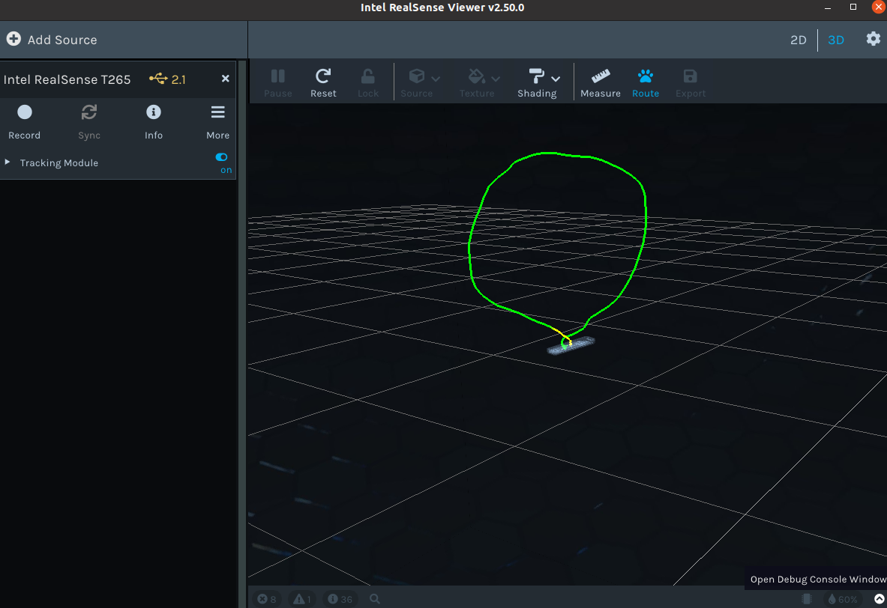

# Intel RealSense T265 Tracking Camera Config
The code supporting End Of Life products: T265 was removed from this release

- The last validated release supporting these products is: [Version 2.50.0](https://github.com/IntelRealSense/librealsense/releases/tag/v2.50.0)
- For more information please refer to https://www.intelrealsense.com/message-to-customers/
- SR300, L515 are in the code and recognized on Linux and Windows, but no longer tested
- For further device support requirements, please refer to the data sheet [here](https://dev.intelrealsense.com/docs/intel-realsense-d400-series-product-family-datasheet)

所以T265最新可以安装2.50.0版本的librealsense

## 1. realsense-viwer

截止2023.6.12，默认直接按照官网的apt安装方法，Viwer的版本是2.54.1，不支持T265；因此需安装低于2.50的版本。

正常安装并连接后，会显示T265连接情况及USB版本：


虽然这里用的是USB2.1，但是建议用USB3

之后打开Tracking Module，在3D情况下：



在2D情况下：


## 2. realsense ros

[ros wiki realsense2_camera](http://wiki.ros.org/realsense2_camera)

### 2.1 install

从我个人观点，不建议直接git clone这个仓库到catkin workspace然后编译，因为这样得到的是开发版，不是release版本；并且也不清楚是ros还是ros2；

可以选择直接apt安装，但是担心由于版本不支持问题，而且也想看看源码；

如果apt安装，对于noetic的ros版本，应为：

```shell
sudo apt-get install ros-noetic-realsense2-camera
```

如果是源码编译安装，由于realsense只支持到2.50，能找到对应的就是[ROS Wrapper for Intel® RealSense™ Devices (build 2.3.2)](https://github.com/IntelRealSense/realsense-ros/releases/tag/2.3.2)

首先安装依赖，ddynamic_reconfigure

```shell
cd catkin_ws/src
git clone git@github.com:pal-robotics/ddynamic_reconfigure.git
cd ..
catkin_make
```

之后再下载realsense-ros包并解压，之后

```shell
catkin_make
```

### 2.2 rostopic

首先是t265对应的launch文件（节选）：

```xml
<launch>
  <arg name="serial_no"           default=""/>
  <arg name="usb_port_id"         default=""/>
  <arg name="device_type"         default="t265"/>
  <arg name="json_file_path"      default=""/>
  <arg name="camera"              default="camera"/>
  <arg name="tf_prefix"           default="$(arg camera)"/>

  <arg name="fisheye_width"       default="-1"/> 
  <arg name="fisheye_height"      default="-1"/>
  <arg name="enable_fisheye1"     default="false"/>
  <arg name="enable_fisheye2"     default="false"/>

  <arg name="fisheye_fps"         default="-1"/>

  <arg name="gyro_fps"            default="-1"/>
  <arg name="accel_fps"           default="-1"/>
  <arg name="enable_gyro"         default="true"/>
  <arg name="enable_accel"        default="true"/>
  <arg name="enable_pose"         default="true"/>

  <arg name="enable_sync"           default="false"/>

  <arg name="linear_accel_cov"      default="0.01"/>
  <arg name="initial_reset"         default="false"/>
  <arg name="reconnect_timeout"     default="6.0"/>
  <arg name="unite_imu_method"      default=""/>

  <arg name="publish_odom_tf"     default="true"/>
```

运行命令为：

```shell
roslaunch realsense2_camera rs_t265.launch
```

不改变参数的情况下，此时`rostopic list`的结果为：

```
/camera/accel/imu_info
/camera/accel/metadata
/camera/accel/sample
/camera/gyro/imu_info
/camera/gyro/metadata
/camera/gyro/sample
/camera/odom/metadata
/camera/odom/sample
/camera/realsense2_camera_manager/bond
/camera/tracking_module/parameter_descriptions
/camera/tracking_module/parameter_updates
```

使用`rostopic echo /camera/odom/sample`命令可以得到里程计参数，如下：

```
---
header: 
  seq: 14786
  stamp: 
    secs: 1686633832
    nsecs: 659694672
  frame_id: "camera_odom_frame"
child_frame_id: "camera_pose_frame"
pose: 
  pose: 
    position: 
      x: 0.020028240978717804
      y: 0.00010194093192694709
      z: 0.0008226075442507863
    orientation: 
      x: -0.26177385449409485
      y: -0.5819356441497803
      z: 0.08996497094631195
      w: 0.7646775245666504
  covariance: [0.01, 0.0, 0.0, 0.0, 0.0, 0.0, 0.0, 0.01, 0.0, 0.0, 0.0, 0.0, 0.0, 0.0, 0.01, 0.0, 0.0, 0.0, 0.0, 0.0, 0.0, 0.0001, 0.0, 0.0, 0.0, 0.0, 0.0, 0.0, 0.0001, 0.0, 0.0, 0.0, 0.0, 0.0, 0.0, 0.0001]
twist: 
  twist: 
    linear: 
      x: 0.0034397062779552823
      y: 0.004387176720412336
      z: -0.00023956704897756754
    angular: 
      x: -0.0066348433291581925
      y: 0.0006404809738670314
      z: -0.008248090952775261
  covariance: [0.01, 0.0, 0.0, 0.0, 0.0, 0.0, 0.0, 0.01, 0.0, 0.0, 0.0, 0.0, 0.0, 0.0, 0.01, 0.0, 0.0, 0.0, 0.0, 0.0, 0.0, 0.0001, 0.0, 0.0, 0.0, 0.0, 0.0, 0.0, 0.0001, 0.0, 0.0, 0.0, 0.0, 0.0, 0.0, 0.0001]
---
```

### 2.3 Frame

坐标系定义；

一些参考的博客和说明文档：

* [Intel realsense T265双目+IMU传感器使用方法介绍，以及如何快速上手编写realsense的代码，进行简单地开发，积分出位姿，使用opencv显示双目图像](https://blog.csdn.net/u011341856/article/details/106430940)
* [Inter RealSenseT265说明文档](https://blog.csdn.net/baidu_36487340/article/details/103642312)
* [Intel Realsense T265使用教程](https://rupingcen.blog.csdn.net/article/details/109544456?spm=1001.2101.3001.6650.1&utm_medium=distribute.pc_relevant.none-task-blog-2%7Edefault%7ECTRLIST%7ERate-1-109544456-blog-103642312.235%5Ev38%5Epc_relevant_sort_base2&depth_1-utm_source=distribute.pc_relevant.none-task-blog-2%7Edefault%7ECTRLIST%7ERate-1-109544456-blog-103642312.235%5Ev38%5Epc_relevant_sort_base2&utm_relevant_index=2)
* [把T265定点过程中的坐标变换彻底弄清楚（包含vision_to_mavros代码分析）px4_command T265定点过程的坐标系转换也理清](https://blog.csdn.net/sinat_16643223/article/details/114572760)

相机坐标系的定义如下：


相机IMU和鱼眼相机的坐标系定义如下：


T265官网给出的坐标系如下，不过这是相机坐标系，并不是我们需要在相机初始化时定义的惯性系定义的自身位姿（里程计的位姿）`/camera/odom/sample`

里程计的位姿是我们在导航时所需要的：


* 由于含有IMU信息，z轴的方向是确定的，即重力加速度方向的负方向
* 最理想的情况，是上图左侧的两种情况，这可以归纳为主光轴方向与重力方向垂直的情况，即使反过来也成立；这种情况下的坐标系很好定义；
* 另一种情况是右上角的情况，当相机的x轴与重力反方向同向时，也有随之定义的y和z
* 另一种情况是相机的y轴与重力反方向同向，此时坐标系仍然与相机相关，并不是东北天定义，但会有些误差，坐标系不完全垂直于相机的面
* 最后是三维空间中任意指向，相机的初始化姿态相对于地球，不是z对z；没解决

如果起飞时，或飞机上电，相机tracking节点初始化时，飞机与地面不是水平放置，则会对这个Tracking的相对坐标系造成影响，如果不分析清楚三维空间中任意指向情况下，坐标系的建立方式的话。

### 2.4 Vision to Mavros

完成坐标系定义分析后，我们假设飞机水平放置，此时可以得到一个T265 tracking的惯性系，坐标原点为飞机的初始位置，z轴指向天空，x轴指向摄像头的方向，y轴根据xy和右手系得到。

> 右手系指，把拇指当作x轴，食指当作y轴，中指当作z轴，来考虑三维坐标。

**注意，以下所有分析均遵从上述假设。**

分析已有的转换库，https://github.com/thien94/vision_to_mavros


其代码要解决的核心问题是，将IMU等相机坐标系下的信息，转换到相机Tracking里程计坐标系下，也就是我们刚刚定义的坐标系下的方法。

我们已经知道，相机的位姿和其里程计之间的位姿存在一个转换关系。根据定义，可以很好地描述这一转换关系，将所有信息都转换到Tracking里程计坐标系下。

现在需要知道如何从T265里程计定义的坐标系，转换到ros坐标系和PX4坐标系；因为这些信息最终都要经由mavros，或是直接或是间接给负责执行其他任务的节点。

要知道如何转换，首先要知道其他两个坐标系的定义方式。

（有没有可能，mavros和PX4的位姿就用的这个坐标系）
