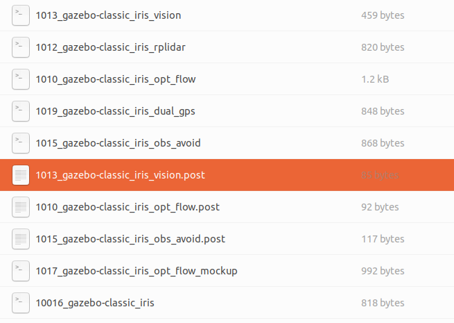

# IRIS MAVROS PX4 gazebo SITL Simulation
四旋翼无人机iris的gazebo仿真，使用PX4和MAVROS

## 1. Config Sdf with Camera

配置带有相机的sdf文件，便于在launch文件中加载并使用。

最常用的`mavros_posix_sitl.launch`，内容如下：

```xml
<?xml version="1.0"?>
<launch>
    <!-- MAVROS posix SITL environment launch script -->
    <!-- launches MAVROS, PX4 SITL, Gazebo environment, and spawns vehicle -->
    <!-- vehicle pose -->
    <arg name="x" default="0"/>
    <arg name="y" default="0"/>
    <arg name="z" default="0"/>
    <arg name="R" default="0"/>
    <arg name="P" default="0"/>
    <arg name="Y" default="0"/>
    <!-- vehicle model and world -->
    <arg name="est" default="ekf2"/>
    <arg name="vehicle" default="iris"/>
    <arg name="world" default="$(find mavlink_sitl_gazebo)/worlds/empty.world"/>
    <arg name="sdf" default="$(find mavlink_sitl_gazebo)/models/$(arg vehicle)/$(arg vehicle).sdf"/>

    <!-- gazebo configs -->
    <arg name="gui" default="true"/>
    <arg name="debug" default="false"/>
    <arg name="verbose" default="false"/>
    <arg name="paused" default="false"/>
    <arg name="respawn_gazebo" default="false"/>
    <!-- MAVROS configs -->
    <arg name="fcu_url" default="udp://:14540@localhost:14557"/>
    <arg name="respawn_mavros" default="false"/>
    <!-- PX4 configs -->
    <arg name="interactive" default="true"/>
    <!-- PX4 SITL and Gazebo -->
    <include file="$(find px4)/launch/posix_sitl.launch">
        <arg name="x" value="$(arg x)"/>
        <arg name="y" value="$(arg y)"/>
        <arg name="z" value="$(arg z)"/>
        <arg name="R" value="$(arg R)"/>
        <arg name="P" value="$(arg P)"/>
        <arg name="Y" value="$(arg Y)"/>
        <arg name="world" value="$(arg world)"/>
        <arg name="vehicle" value="$(arg vehicle)"/>
        <arg name="sdf" value="$(arg sdf)"/>
        <arg name="gui" value="$(arg gui)"/>
        <arg name="interactive" value="$(arg interactive)"/>
        <arg name="debug" value="$(arg debug)"/>
        <arg name="verbose" value="$(arg verbose)"/>
        <arg name="paused" value="$(arg paused)"/>
        <arg name="respawn_gazebo" value="$(arg respawn_gazebo)"/>
    </include>
    <!-- MAVROS -->
    <include file="$(find mavros)/launch/px4.launch">
        <!-- GCS link is provided by SITL -->
        <arg name="gcs_url" value=""/>
        <arg name="fcu_url" value="$(arg fcu_url)"/>
        <arg name="respawn_mavros" value="$(arg respawn_mavros)"/>
    </include>
</launch>
```

 默认加载的sdf模型是iris，不配有任何相机。

在最新的PX4-Autopilot中，各种sdf model被放在了`PX4-Autopilot/Tools/simulation/gazebo-classic/sitl_gazebo-classic/models`目录下，可以找到如`iris_stereo_camera`等已经配有传感器的sdf模型，参考这个文件sdf的写法：

```xml
<?xml version="1.0" ?>
<sdf version='1.5'>
  <model name='iris_stereo_camera'>
    <include>
      <uri>model://iris</uri>
    </include>

    <include>
      <uri>model://stereo_camera</uri>
      <pose>0.1 0 0 0 0 0</pose>
    </include>
    <joint name="stereo_camera_joint" type="revolute">
      <child>stereo_camera::link</child>
      <parent>iris::base_link</parent>
      <axis>
        <xyz>0 0 1</xyz>
        <limit>
          <upper>0</upper>
          <lower>0</lower>
        </limit>
      </axis>
    </joint>

  </model>
</sdf>
```

我配置了深度加双目的相机：

```xml
<?xml version="1.0" ?>
<sdf version='1.5'>
  <model name='iris_stereo_depth_camera'>
    <include>
      <uri>model://iris</uri>
    </include>

    <include>
      <uri>model://stereo_camera</uri>
      <pose>0.1 0 -0.1 0 0 0</pose>
    </include>
    <joint name="stereo_camera_joint" type="revolute">
      <child>stereo_camera::link</child>
      <parent>iris::base_link</parent>
      <axis>
        <xyz>0 0 1</xyz>
        <limit>
          <upper>0</upper>
          <lower>0</lower>
        </limit>
      </axis>
    </joint>
    
    <include>
      <uri>model://depth_camera</uri>
      <pose>0.1 0 0.1 0 0 0</pose>
    </include>
    <joint name="depth_camera_joint" type="revolute">
      <child>depth_camera::link</child>
      <parent>iris::base_link</parent>
      <axis>
        <xyz>0 0 1</xyz>
        <limit>
          <upper>0</upper>
          <lower>0</lower>
        </limit>
      </axis>
    </joint>

  </model>
</sdf>
```

同时，也要更改config中的一些参数，使匹配；

最后更改`mavros_posix_sitl.launch`中的`vehicle`参数，改成我们用的`iris_stereo_depth_camera`，运行该launch文件，报错如下：

```
ERROR [init] Unknown model gazebo-classic_iris_stereo_camera (not found by name on /home/hazyparker/.ros/etc/init.d-posix/airframes)
ERROR [px4] Startup script returned with return value: 256

================================================================================REQUIRED process [sitl-2] has died!
process has died [pid 130900, exit code 255, cmd /home/hazyparker/Applications/PX4-Autopilot/build/px4_sitl_default/bin/px4 /home/hazyparker/Applications/PX4-Autopilot/build/px4_sitl_default/etc -s etc/init.d-posix/rcS __name:=sitl __log:=/home/hazyparker/.ros/log/93fbc9ba-0f42-11ee-8acb-9f1c1f2a7ae5/sitl-2.log].
log file: /home/hazyparker/.ros/log/93fbc9ba-0f42-11ee-8acb-9f1c1f2a7ae5/sitl-2*.log
Initiating shutdown!
================================================================================
```

 对于`.ros/etc/init.d-posix/airframes`中的文件，



确实只有classic-iris；

* 一种方法是在iris.sdf中直接加相机；
* 但如何使用这种更便捷的配置呢？

提到的“一种方法”就是直接去改`iris.sdf`，最后几行加上我们要的相机，如：

```xml
      </control_channels>
    </plugin>
    <static>0</static> 
    
    <!-- 开始添加 begin here -->
    <include>
      <uri>model://stereo_camera</uri>
      <pose>0.1 0 -0.02 0 0 0</pose>
    </include>
    <joint name="stereo_camera_joint" type="revolute">
      <child>stereo_camera::link</child>
      <parent>iris::base_link</parent>
      <axis>
        <xyz>0 0 1</xyz>
        <limit>
          <upper>0</upper>
          <lower>0</lower>
        </limit>
      </axis>
    </joint>
    
    <include>
      <uri>model://depth_camera</uri>
      <pose>0.1 0 0.02 0 0 0</pose>
    </include>
    <joint name="depth_camera_joint" type="revolute">
      <child>depth_camera::link</child>
      <parent>iris::base_link</parent>
      <axis>
        <xyz>0 0 1</xyz>
        <limit>
          <upper>0</upper>
          <lower>0</lower>
        </limit>
      </axis>
    </joint>
    <!-- 结束添加 stop here -->    

  </model>
</sdf>
```

但是这样很不便捷，可能也不适用于多机。

仍然放上我使用第二种方式改装的[iris model](iris)；只复制`iris.sdf`即可。

## 2. VINS fusion config

我们使用VINS-Fusion方案完成位姿估计，直接用深度图给planner，因此在此处需要先使用VINS-Fusion方案解算位姿。

采用如下脚本，sh文件：

```sh
#! /bin/bash

# this format can only do jobs one by one
# roslaunch vins vins_rviz.launch
# rosrun vins vins_node ~/catkin_ws/src/VINS-Fusion/config/euroc/euroc_stereo_imu_config.yaml

# so we open multi terminals
gnome-terminal --tab -- bash -c 'roslaunch vins vins_rviz.launch'
gnome-terminal --tab -- bash -c 'rosrun vins vins_node ~/catkin_ws/src/VINS-Fusion/config/simulation/simulation_config.yaml'
```

这样可以通过一个文件启动两个终端，比较方便，一键完成；注意更改自己VINS配置文件的位置，且在yaml文件中需要更改相机和IMU话题：

```yaml
%YAML:1.0

#common parameters
imu: 1
num_of_cam: 2  # 1 or 2

imu_topic: "/mavros/imu/data"
image0_topic: "/stereo/left/image_raw"
image1_topic: "/stereo/right/image_raw"
output_path: "/home/hazyparker/ros_user_log"

cam0_calib: "cam0_mei.yaml"
cam1_calib: "cam1_mei.yaml"
image_width: 600
image_height: 600
```

如果不知道是哪个话题，就把仿真打开，rostopic list，找可能的去info看消息类型，或者echo看内容和消息类型；

但是这样的配置文件有些问题，vins节点直接退了，应该是内参之类的问题。

于是暂时地，我们直接用mavros的里程计代替VINS的里程计，用depth camera结合里程计完成planner；

对应的mavros里程计话题为`/mavros/local_position/odom`；

## 3. depth camera

`camera/depth/image_rect_raw`的消息类型为`Sensor_msgs/Image`
